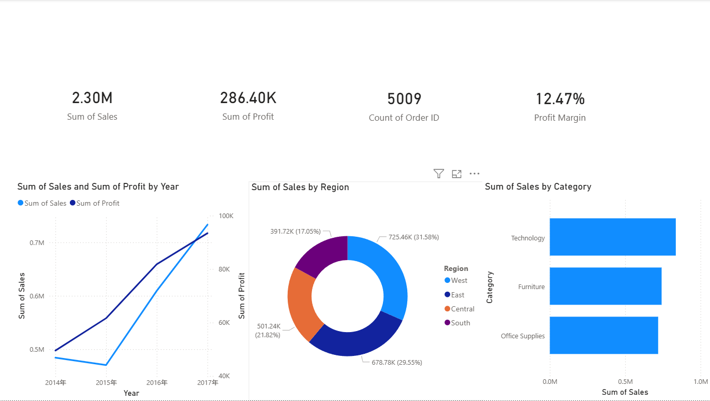
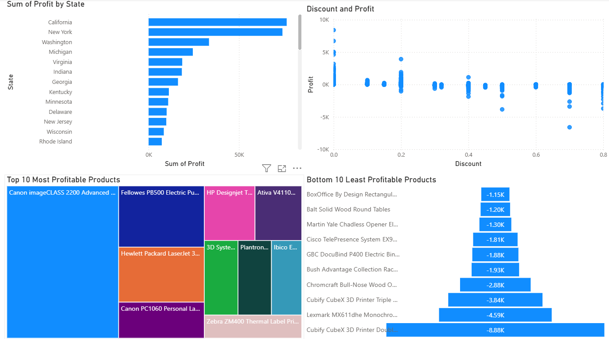

# Superstore Sales Dashboard

## Overview
An interactive Power BI dashboard analyzing sales performance of a US retail superstore. The dashboard helps executives quickly identify top-performing regions, categories, and time-based trends.

## Dataset
- **Source:** [Kaggle - Superstore Dataset](https://www.kaggle.com/datasets/vivek468/superstore-dataset-final)
- **Records:** 9,994 orders
- **Fields:** Order Date, Ship Date, Segment, Country, City, State, Region, Category, Sub-Category, Sales, Quantity, Discount, Profit

## Dashboard Pages

### Page 1: Sales Overview
- Total Sales, Total Profit, Total Orders, Profit Margin (KPI cards)
- Sales & Profit trend by month (line chart)
- Sales by Region (map or bar chart)
- Sales by Category & Sub-Category (bar chart)

### Page 2: Profitability Analysis
- Profit by State (filled map — identify loss-making states)
- Discount vs Profit correlation (scatter plot)
- Top 10 most profitable products
- Bottom 10 least profitable products

## Key Insights
- [To be filled after building the dashboard]

## Screenshots

## How to Open
1. Download [Power BI Desktop](https://powerbi.microsoft.com/desktop/) (free)
2. Download the `.pbix` file from this folder
3. Open it in Power BI Desktop
