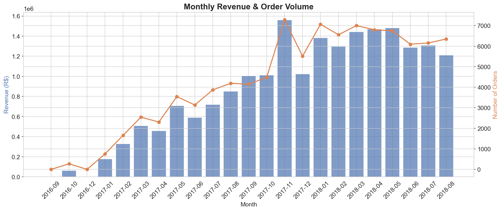
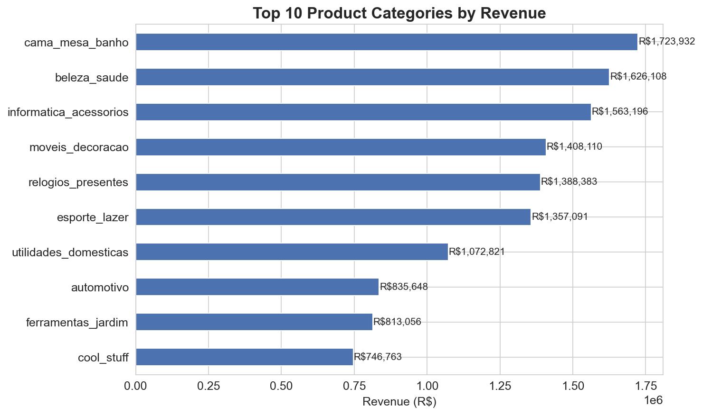
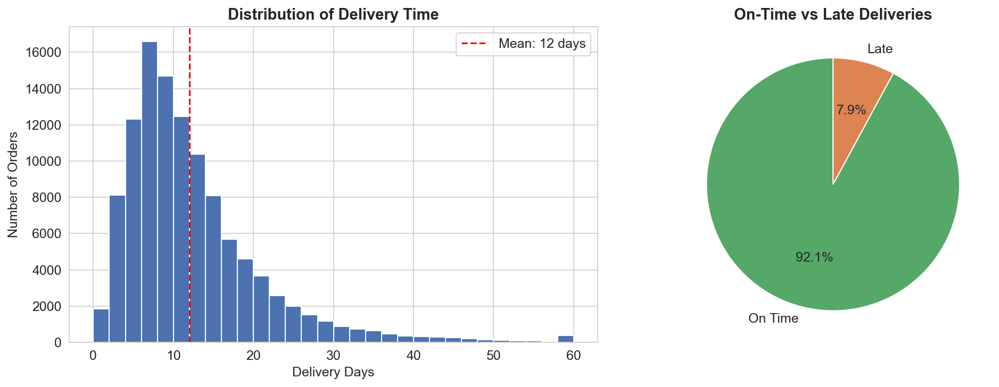
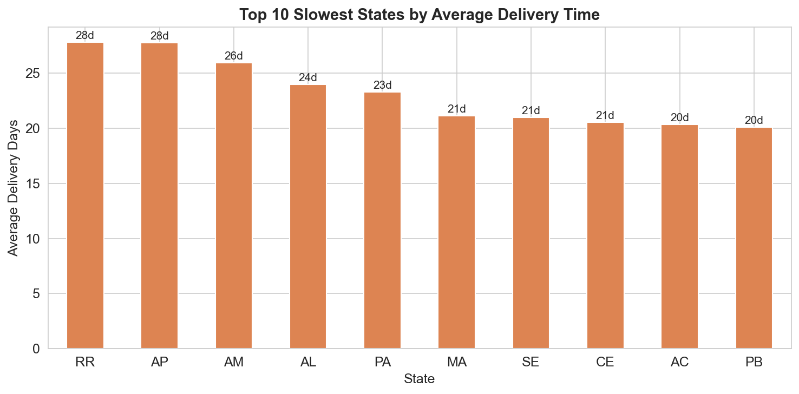
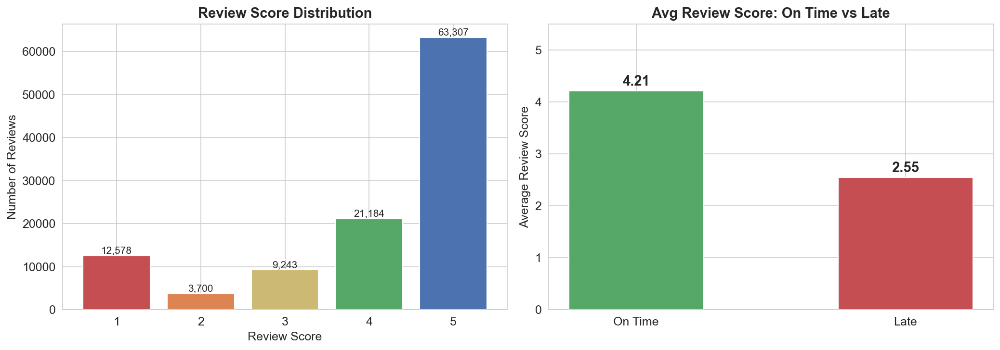
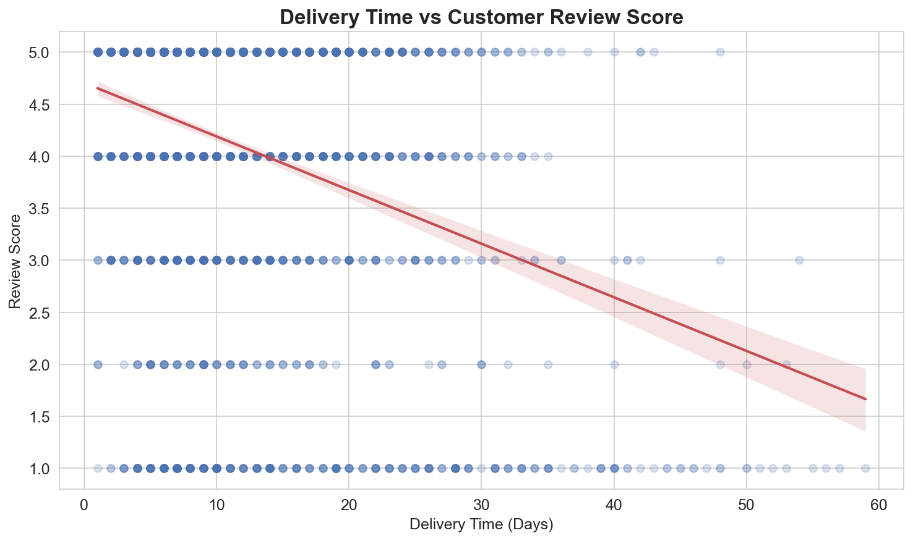

# E-Commerce Customer & Delivery Analysis

## Overview
Exploratory data analysis of 100K+ orders from Olist, a Brazilian e-commerce marketplace. This project investigates customer satisfaction drivers and delivery performance to provide actionable business recommendations.

## Dataset
- **Source:** [Kaggle - Brazilian E-Commerce (Olist)](https://www.kaggle.com/datasets/olistbr/brazilian-ecommerce)
- **Records:** 99,441 orders (2016-2018)
- **Tables:** Orders, Order Items, Products, Customers, Sellers, Reviews, Payments (7 tables merged into one analysis-ready dataset of 110,839 rows)

## Analysis Structure

### 1. Data Cleaning & Preparation
- Handled missing values (160 unapproved orders, 2,965 undelivered orders)
- Parsed 5 date columns and created time features (month, year, day of week)
- Calculated delivery time in days and late delivery flag
- Merged 7 tables into one analysis-ready dataset

### 2. Sales & Revenue Analysis
- Monthly order volume and revenue trends (dual-axis chart)
- Top 10 product categories by revenue (horizontal bar chart)

### 3. Delivery Performance
- Delivery time distribution with mean indicator (histogram)
- On-time vs late delivery rates (pie chart)
- Top 10 slowest states by average delivery time (bar chart)

### 4. Customer Satisfaction
- Review score distribution (bar chart — 5 stars most common)
- Average review score: on-time vs late delivery (comparison bar chart)
- Delivery time vs review score correlation (scatter plot with regression line)

## Key Insights
1. **Revenue Growth:** Order volume and revenue showed strong growth from 2017 to 2018, with a peak in late 2017
2. **Average Delivery:** 12.1 days from purchase to delivery across all orders
3. **Late Delivery Rate:** 7.9% of orders were delivered after the estimated date
4. **Delivery Kills Ratings:** Late deliveries significantly reduce customer satisfaction — on-time orders average ~4.2 stars vs ~2.5 stars for late orders
5. **Regional Gaps:** Remote states (e.g., northern Brazil) experience 2-3x longer delivery times than São Paulo
6. **Top Categories:** Home/decor, health/beauty, and electronics drive the most revenue
7. **Negative Correlation:** Scatter plot confirms longer delivery time = lower review score

## Recommendations
1. **Prioritize delivery speed** in slow states — consider regional warehouses or local fulfillment partners
2. **Set realistic delivery estimates** — customers rate worse when expectations aren't met, even if absolute delivery time is acceptable
3. **Focus on top categories** — invest in inventory and seller quality for highest-revenue product types
4. **Follow up with low-rating customers** — target orders with late delivery for proactive recovery outreach

## Charts Generated
| Chart | Description |
|-------|-------------|
|  | Monthly revenue & order volume trend |
|  | Top 10 product categories by revenue |
|  | Delivery time distribution & on-time rate |
|  | Top 10 slowest states by delivery time |
|  | Review score distribution & late delivery impact |
|  | Delivery time vs review score correlation |

## Tools Used
- Python 3.11
- Pandas, NumPy
- Matplotlib, Seaborn
- Jupyter Notebook

## How to Run
```bash
conda activate da
cd 02-olist-ecommerce-analysis
jupyter notebook analysis.ipynb
```

## Data
Download the dataset from [Kaggle](https://www.kaggle.com/datasets/olistbr/brazilian-ecommerce) and place CSV files in the `data/` folder.
