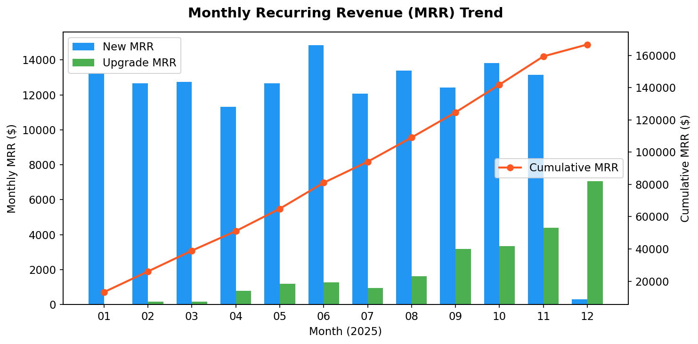
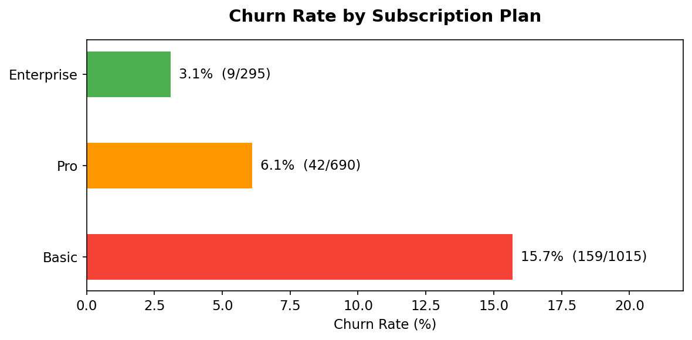
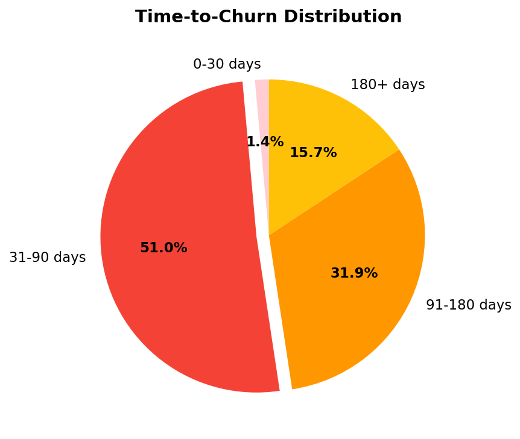
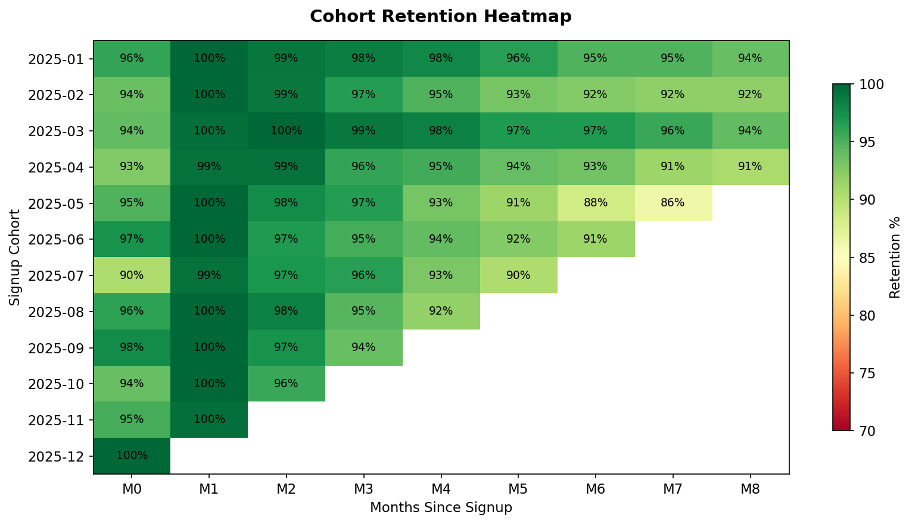
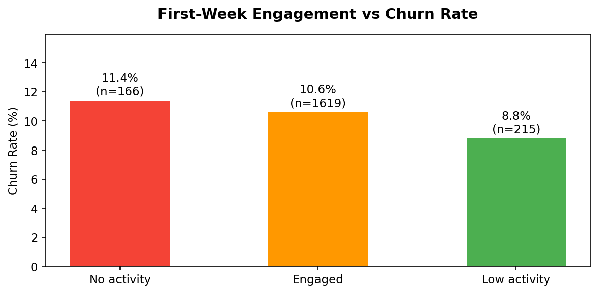

# SaaS Subscription & Retention Analysis (SQL)

## Business Context

A fictional B2B SaaS company "CloudMetrics" offers three subscription plans (Basic / Pro / Enterprise). The management team has noticed **rising churn** in recent months and wants answers to:

1. What is our Monthly Recurring Revenue (MRR) trend?
2. Which plan has the highest churn rate?
3. What does the cohort retention curve look like?
4. Are there early warning signals that predict churn?

## Business Story

> **Quarter review meeting:** The VP of Customer Success reports that Q4 revenue missed target by 12%. The CFO asks: "Is this a new-customer acquisition problem or an existing-customer retention problem?" This analysis provides the data-driven answer.

## Dataset

Simulated dataset (generated via Python) covering 12 months of activity for ~2,000 customers across 3 tables:

| Table | Rows | Description |
|-------|------|-------------|
| `customers` | 2,000 | Customer info: sign-up date, plan, company size, industry |
| `subscriptions` | 2,394 | Subscription events: new, cancel, upgrade |
| `usage_logs` | 191,009 | Daily product usage: logins, features used, session minutes |

## Key Findings

### 1. MRR Trend — Revenue is growing but decelerating



Upgrade revenue is growing (from $0 → $7K/mo), but new sign-up MRR slowed sharply in December.

### 2. Churn Rate — Basic plan is the biggest problem



Basic plan churn (15.7%) is **5× higher** than Enterprise (3.1%).

### 3. Time-to-Churn — Most leave within 90 days



Over half of all churn happens in the first 90 days — the onboarding window is critical.

### 4. Cohort Retention Matrix



Retention drops noticeably at **M4–M5** across all cohorts (~97% → ~91%).

### 5. First-Week Engagement vs Churn



Users with zero first-week activity show the highest churn rate.

## Recommendations

| # | Finding | Recommendation |
|---|---------|---------------|
| 1 | Basic plan churn is 5× Enterprise | Introduce guided onboarding for Basic tier to drive feature adoption |
| 2 | 51% of churn happens within 90 days | Implement automated activation emails if no login within 3 days |
| 3 | Retention drops at M4–M5 | Schedule proactive CS check-in at day 90 |
| 4 | Zero first-week activity → highest churn | Build usage-drop alert dashboard for CS team |
| 5 | Upgrade MRR is growing organically | Double down on upgrade nudges — biggest revenue lever |

## SQL Skills Demonstrated

| Skill | Where Used |
|-------|-----------|
| **Window Functions** | MRR running totals, retention cohort ranking |
| **CTEs** | Multi-step churn analysis pipeline |
| **CASE expressions** | Plan segmentation, churn flag logic |
| **Date functions** | Cohort month calculation, time-to-churn |
| **Aggregation & GROUP BY** | Revenue by plan, monthly active users |
| **Subqueries** | Identifying at-risk customers |
| **JOINs** | Linking customers → subscriptions → usage |

## File Structure

```
03-sql-saas-retention/
├── README.md
├── data/
│   ├── customers.csv
│   ├── subscriptions.csv
│   └── usage_logs.csv
├── 01_schema_and_import.sql      -- Table creation & data loading
├── 02_revenue_analysis.sql       -- MRR trends & plan breakdown
├── 03_churn_analysis.sql         -- Churn rates by segment
├── 04_cohort_retention.sql       -- Monthly cohort retention matrix
├── 05_churn_prediction.sql       -- Early warning signals
├── 06_executive_summary.sql      -- Key metrics for leadership
├── generate_data.py              -- Script used to create simulated dataset
└── run_all.py                    -- One-click runner (SQLite)
```

## How to Run

```bash
python run_all.py
```

This loads CSV data into a local SQLite database and executes all analysis queries. No database installation required.

SQL files use **PostgreSQL syntax** for portfolio demonstration — they can be loaded into any PostgreSQL instance directly.

## Tools Used

- **SQL** (PostgreSQL-compatible syntax)
- **Python** (data simulation & SQLite runner)
